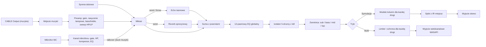

# Cyfrowy soundsystem roots and culture (Windows 11, PySide6)

## Założenia
- Projekt wyrasta z planu 12-pasmowego EQ; EQ zostaje jako globalna korekcja toru.
- Tor sygnału odwzorowuje klasyczny układ soundsystemu: źródło (deck), przedwzmacniacz z echem, aktywna zwrotnica, wzmacniacze i kolumny dla każdej drogi, miejsce.
- Dwa tryby wyjścia przełączane w aplikacji: **Symulacja** (stereo, słuchawki lub zwykłe głośniki) i **Multi** (osobne drogi na kanałach karty wielokanałowej).
- Źródło muzyki: VB-Cable (CABLE Output), jak w pierwotnym planie. Mikrofon: dowolne urządzenie WASAPI.

## Tor sygnału

## Stos
- `PySide6`, `sounddevice` (WASAPI), `numpy`, `scipy`, `pyqtgraph`, `soundfile` (wczytywanie IR w WAV)
- Opcjonalnie `numba` do pętli próbka po próbce (linia opóźniająca echa, syrena, waveshaper) i `mido` + `python-rtmidi` do sterowania kontrolerem MIDI

## Struktura projektu: `c:\Users\eastwood\Project\Python\roots_soundsystem\`
- `main.py` - punkt wejścia
- `dsp/biquad.py` - współczynniki RBJ (peaking, shelf, HP/LP, allpass), pomocnicze `sosfilt` ze stanem `zi`
- `dsp/eq12.py` - 12-pasmowy EQ (pasma i zachowanie jak w pierwotnym planie)
- `dsp/preamp.py` - gain, nasycenie lampowe (asymetryczny waveshaper z oversamplingiem 2x), półki bass/treble w stylu Baxandall, filtry sweep HP i LP z rezonansem (SVF), master
- `dsp/isolator.py` - 5-drożny izolator
- `dsp/crossover.py` - zwrotnica Linkwitz-Riley
- `dsp/cabinets.py` - modele kolumn dla trybu Symulacja
- `dsp/room.py` - splot partycjonowany (overlap-save w FFT) z IR, mieszanie dry/wet
- `dsp/fx_echo.py`, `dsp/fx_spring.py`, `dsp/fx_siren.py` - efekty dubowe
- `dsp/mic.py` - kanał mikrofonu
- `dsp/protect.py` - limitery dróg, rampy wzmocnienia, wyciszenie przy starcie
- `dsp/graph.py` - klasa `SignalChain` składająca moduły, atomowa podmiana parametrów
- `engine/audio_engine.py` - strumienie wejściowe muzyki i mikrofonu, strumień wyjściowy (2 lub N kanałów), bufory kołowe, przełączanie trybów i urządzeń
- `engine/params.py` - rejestr parametrów (nazwa, zakres, wartość domyślna, wygładzanie), wspólny dla GUI, presetów i MIDI
- `presets/` - presety scen (JSON w `%APPDATA%\RootsSoundsystem\`) oraz wbudowane IR i profile kolumn
- `ui/main_window.py`, `ui/panels/` (preamp, eq12, izolator, zwrotnica, dub, mic, miejsce, wyjście), `ui/widgets/` (pokrętło, suwak pasma, przycisk chwilowy, miernik)
- `tests/`, `requirements.txt`, `README.md`

## Moduły DSP

### Przedwzmacniacz
- Nasycenie: `y = tanh(k*(x + bias)) - tanh(k*bias)`, parametr drive; oversampling 2x filtrem półpasmowym, żeby uniknąć aliasingu
- Bass i treble jako półki (około 100 Hz i 5 kHz, +-15 dB), duże pokrętła sweep HP (20-1000 Hz) i LP (500 Hz-20 kHz) z regulacją rezonansu - typowy gest „przemiatania” w stylu dub
- Wszystkie parametry wygładzane (jednobiegunowy filtr parametru), żeby kręcenie nie trzeszczało

### Izolator 5-drożny z kill (variable)
- Pasma: sub, bass, low-mid, high-mid, top; częstotliwości podziału regulowane (domyślnie 60, 250, 1200, 5000 Hz)
- Drzewo filtrów LR4 z kompensacją allpass w każdej gałęzi, więc suma przy 0 dB jest płaska w amplitudzie
- Dla każdego pasma ciągłe wzmocnienie od kill (-inf) do +6 dB oraz przycisk kill chwilowy lub zatrzaskowy; przejście kill z rampą około 5 ms

### Zwrotnica
- 2 do 4 dróg (sub, bass, mid, top), LR4 lub LR2, regulowane punkty podziału, wzmocnienie, polaryzacja i opóźnienie (wyrównanie czasowe) dla każdej drogi
- Obowiązkowy HP na drodze top (ochrona tweeterów) i HP subsonic około 25 Hz na drodze sub

### Tryb Symulacja: kolumny i miejsce
- Profile kolumn jako zestawy biquadów: bass bin/scoop (rezonans tuby w okolicach 45-60 Hz, spadek poniżej), mid horn, tweeter tubowy (charakterystyczna prezencja w okolicach 3-6 kHz) plus łagodna kompresja głośnika
- Suma dróg do stereo z rozstawieniem (pan i małe opóźnienie dla każdego stosu)
- Akustyka: splot partycjonowany z IR (bloki równe blokowi audio, FFT przez `numpy.fft.rfft`); wbudowane IR generowane proceduralnie (dancehall, sala z betonem, plener) oraz wczytywanie własnych WAV z resamplingiem do 48 kHz
- Opcjonalny „bass feel” na słuchawki: synteza harmonicznych dla sub (psychoakustyczne wzmocnienie basu)

### Tryb Multi: wyjście wielokanałowe
- Mapowanie dróg na kanały urządzenia (np. 8 kanałów: sub L/R, bass L/R, mid L/R, top L/R), konfigurowalne w panelu wyjścia
- Limiter typu brickwall dla każdej drogi z progiem, wyciszenie przy starcie i rampa wzmocnienia, potwierdzenie przed włączeniem wyjścia
- Pominięcie modeli kolumn i splotu z IR

### Efekty dubowe
- **Echo taśmowe**: linia opóźniająca z interpolacją ułamkową, czas 20-1500 ms, tap tempo i synchronizacja z BPM (1/4, 1/8 z kropką, 1/8), sprzężenie do samooscylacji, HP/LP i `tanh` w pętli sprzężenia, wow/flutter (LFO), przycisk „throw” (chwilowy send), płynna zmiana czasu z efektem pitch jak w taśmie
- **Reverb sprężynowy**: uproszczony model dyspersyjny (łańcuch allpassów + linie opóźniające z modulacją) lub splot z IR sprężyny; regulacja decay, tone, mix, przycisk „crash”
- **Syrena dubowa**: oscylator (sinus, trójkąt, prostokąt) z LFO (rate, depth, kształt), pitch sweep, przyciski chwilowe triggera i kilka pamięci ustawień; wyjście syreny idzie przez echo

### Kanał mikrofonu MC
- Osobny `InputStream` z urządzenia mikrofonowego, noise gate, HP 100 Hz, kompresor, 3-pasmowy EQ, własny send do echa, talkover (ducking muzyki o regulowaną wartość), wskaźnik latencji

## Silnik i wydajność
- 48 kHz, blok 512 próbek (około 10.7 ms); cały tor liczony w callbacku wyjściowym na blokach `numpy`
- Parametry z GUI trafiają do `SignalChain` przez kolejkę bez blokowania (lub podmianę referencji pod `threading.Lock`); współczynniki filtrów liczone poza callbackiem
- Budżet CPU mierzony na bieżąco (czas przetwarzania bloku / czas bloku) i widoczny w pasku stanu; moduły wyłączone są omijane
- Wąskie gardła próbka po próbce (echo z modulacją, syrena, sprężyna) w `numba`, z wersją czysto numpy jako rezerwą

## GUI
- Układ jak w stole soundsystemowym: od lewej preamp, mic, dub (echo, sprężyna, syrena), izolator, zwrotnica, EQ12, wyjście
- Duże pokrętła, przyciski chwilowe (throw, siren, kill) reagujące na przytrzymanie; skróty klawiszowe dla kill i throw
- Wykresy: odpowiedź całego toru, podział zwrotnicy, analizator widma dla każdej drogi, mierniki poziomu dróg z ostrzeżeniem o przesterowaniu
- Presety scen (cały stan toru), `QSettings` na urządzenia i układ okna, ciemny motyw, tray
- Opcjonalnie mapowanie MIDI (learn: poruszenie kontrolki i przypisanie do parametru z `engine/params.py`)

## Obsługa błędów
- Jak w pierwotnym planie (brak VB-Cable, utrata urządzenia, niedobory bufora wypełniane ciszą)
- Tryb Multi: sprawdzenie liczby kanałów urządzenia, blokada startu przy niepoprawnym mapowaniu
- Przekroczenie budżetu CPU: ostrzeżenie i propozycja zwiększenia bloku lub wyłączenia splotu

## Etap 2: rozwoj (od 2026-10-08)

Kolejnosc: najpierw porzadki i testy (bezpieczna podstawa), potem poprawki DSP, projekt interfejsu, migracja na QML i nowe funkcje.

### Stan wyjsciowy
- Testy DSP: 37/37 przechodza; wydajnosc pelnego toru ok. 33% czasu bloku (bez numba).
- ruff: 35 uwag, glownie kolejnosc importow i `zip` bez `strict`; brak powaznych bledow.
- Brak repozytorium git - do zalozenia przed wiekszymi zmianami.
- UI jest na Qt Widgets, nie QML (opis projektu zaklada QML).

### Rozbieznosci plan vs stan
- Kill izolatora: plan zaklada >= 60 dB, osiagniete 38-57 dB przy 5 waskich pasmach.
- MIDI: zamiast `python-rtmidi` backend `pygame-ce` (brak kol dla Pythona 3.14).

### Interfejs (2.3-2.4)
- Dwa tryby pracy: LIVE (duze kontrolki, gesty dubowe, minimum rozpraszaczy) i KONFIGURACJA (urzadzenia, zwrotnica, mapowanie, miejsce).
- QML: `ParamStore` wystawiony jako model/obiekt Pythona, komponenty Knob, Fader, MomentaryButton, Meter; wykresy przez QtGraphs lub obraz z pyqtgraph.
- Migracja panel po panelu, z zachowaniem dzialajacej wersji Widgets do konca etapu.

## Weryfikacja
- EQ12: przy 0 dB wyjście równe wejściu, przy +6 dB na 1 kHz około +6 dB
- Izolator i zwrotnica: suma pasm przy 0 dB płaska w amplitudzie w granicach +-0.1 dB; kill tłumi pasmo o co najmniej 60 dB w jego środku
- Splot partycjonowany zgodny z `scipy.signal.fftconvolve` z dokładnością numeryczną
- Echo: impuls daje powtórzenia w oczekiwanym czasie i spadek zgodny ze sprzężeniem
- Test wydajności: pełny tor na bloku 512 poniżej 50% czasu bloku
- Test ręczny: muzyka przez CABLE Input, sprawdzenie sweepów, kill, throw, syreny, mikrofonu i obu trybów wyjścia
