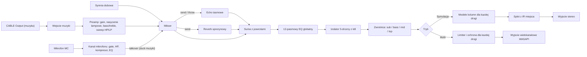

# Cyfrowy soundsystem roots and culture (Windows 11, PySide6)

## Założenia
- Projekt wyrasta z planu 12-pasmowego EQ; EQ zostaje jako globalna korekcja toru.
- Tor sygnału odwzorowuje klasyczny układ soundsystemu: źródło (deck), przedwzmacniacz z echem, aktywna zwrotnica, wzmacniacze i kolumny dla każdej drogi, miejsce.
- Dwa tryby wyjścia przełączane w aplikacji: **Symulacja** (stereo, słuchawki lub zwykłe głośniki) i **Multi** (osobne drogi na kanałach karty wielokanałowej).
- Źródło muzyki: VB-Cable (CABLE Output), jak w pierwotnym planie. Mikrofon: dowolne urządzenie WASAPI.

## Tor sygnału

## Stos
- `PySide6`, `sounddevice` (WASAPI), `numpy`, `scipy`, `pyqtgraph`, `soundfile` (wczytywanie IR w WAV)
- Opcjonalnie `numba` do pętli próbka po próbce (linia opóźniająca echa, syrena, waveshaper) i `mido` + `python-rtmidi` do sterowania kontrolerem MIDI

## Struktura projektu
- `main.py` - punkt wejścia
- `dsp/biquad.py` - współczynniki RBJ (peaking, shelf, HP/LP, allpass), pomocnicze `sosfilt` ze stanem `zi`
- `dsp/eq12.py` - 12-pasmowy EQ (pasma i zachowanie jak w pierwotnym planie)
- `dsp/preamp.py` - gain, nasycenie lampowe (asymetryczny waveshaper z oversamplingiem 2x), półki bass/treble w stylu Baxandall, filtry sweep HP i LP z rezonansem (SVF), master
- `dsp/isolator.py` - 5-drożny izolator
- `dsp/crossover.py` - zwrotnica Linkwitz-Riley
- `dsp/cabinets.py` - modele kolumn dla trybu Symulacja
- `dsp/room.py` - splot partycjonowany (overlap-save w FFT) z IR, mieszanie dry/wet
- `dsp/fx_echo.py`, `dsp/fx_spring.py`, `dsp/fx_siren.py` - efekty dubowe
- `dsp/mic.py` - kanał mikrofonu
- `dsp/protect.py` - limitery dróg, rampy wzmocnienia, wyciszenie przy starcie
- `dsp/graph.py` - klasa `SignalChain` składająca moduły, atomowa podmiana parametrów
- `engine/audio_engine.py` - strumienie wejściowe muzyki i mikrofonu, strumień wyjściowy (2 lub N kanałów), bufory kołowe, przełączanie trybów i urządzeń
- `engine/params.py` - rejestr parametrów (nazwa, zakres, wartość domyślna, wygładzanie), wspólny dla GUI, presetów i MIDI
- `presets/` - presety scen (JSON w `%APPDATA%\RootsSoundsystem\`) oraz wbudowane IR i profile kolumn
- `ui/main_window.py`, `ui/panels/` (preamp, eq12, izolator, zwrotnica, dub, mic, miejsce, wyjście), `ui/widgets/` (pokrętło, suwak pasma, przycisk chwilowy, miernik)
- `tests/`, `requirements.txt`, `README.md`

## Moduły DSP

### Przedwzmacniacz
- Nasycenie: `y = tanh(k*(x + bias)) - tanh(k*bias)`, parametr drive; oversampling 2x filtrem półpasmowym, żeby uniknąć aliasingu
- Bass i treble jako półki (około 100 Hz i 5 kHz, +-15 dB), duże pokrętła sweep HP (20-1000 Hz) i LP (500 Hz-20 kHz) z regulacją rezonansu - typowy gest „przemiatania” w stylu dub
- Wszystkie parametry wygładzane (jednobiegunowy filtr parametru), żeby kręcenie nie trzeszczało

### Izolator 5-drożny z kill (variable)
- Pasma: sub, bass, low-mid, high-mid, top; częstotliwości podziału regulowane (domyślnie 60, 250, 1200, 5000 Hz)
- Drzewo filtrów LR4 z kompensacją allpass w każdej gałęzi, więc suma przy 0 dB jest płaska w amplitudzie
- Dla każdego pasma ciągłe wzmocnienie od kill (-inf) do +6 dB oraz przycisk kill chwilowy lub zatrzaskowy; przejście kill z rampą około 5 ms

### Zwrotnica
- 2 do 4 dróg (sub, bass, mid, top), LR4 lub LR2, regulowane punkty podziału, wzmocnienie, polaryzacja i opóźnienie (wyrównanie czasowe) dla każdej drogi
- Obowiązkowy HP na drodze top (ochrona tweeterów) i HP subsonic około 25 Hz na drodze sub

### Tryb Symulacja: kolumny i miejsce
- Profile kolumn jako zestawy biquadów: bass bin/scoop (rezonans tuby w okolicach 45-60 Hz, spadek poniżej), mid horn, tweeter tubowy (charakterystyczna prezencja w okolicach 3-6 kHz) plus łagodna kompresja głośnika
- Suma dróg do stereo z rozstawieniem (pan i małe opóźnienie dla każdego stosu)
- Akustyka: splot partycjonowany z IR (bloki równe blokowi audio, FFT przez `numpy.fft.rfft`); wbudowane IR generowane proceduralnie (dancehall, sala z betonem, plener) oraz wczytywanie własnych WAV z resamplingiem do 48 kHz
- Opcjonalny „bass feel” na słuchawki: synteza harmonicznych dla sub (psychoakustyczne wzmocnienie basu)

### Tryb Multi: wyjście wielokanałowe
- Mapowanie dróg na kanały urządzenia (np. 8 kanałów: sub L/R, bass L/R, mid L/R, top L/R), konfigurowalne w panelu wyjścia
- Limiter typu brickwall dla każdej drogi z progiem, wyciszenie przy starcie i rampa wzmocnienia, potwierdzenie przed włączeniem wyjścia
- Pominięcie modeli kolumn i splotu z IR

### Efekty dubowe
- **Echo taśmowe**: linia opóźniająca z interpolacją ułamkową, czas 20-1500 ms, tap tempo i synchronizacja z BPM (1/4, 1/8 z kropką, 1/8), sprzężenie do samooscylacji, HP/LP i `tanh` w pętli sprzężenia, wow/flutter (LFO), przycisk „throw” (chwilowy send), płynna zmiana czasu z efektem pitch jak w taśmie
- **Reverb sprężynowy**: uproszczony model dyspersyjny (łańcuch allpassów + linie opóźniające z modulacją) lub splot z IR sprężyny; regulacja decay, tone, mix, przycisk „crash”
- **Syrena dubowa**: oscylator (sinus, trójkąt, prostokąt) z LFO (rate, depth, kształt), pitch sweep, przyciski chwilowe triggera i kilka pamięci ustawień; wyjście syreny idzie przez echo

### Kanał mikrofonu MC
- Osobny `InputStream` z urządzenia mikrofonowego, noise gate, HP 100 Hz, kompresor, 3-pasmowy EQ, własny send do echa, talkover (ducking muzyki o regulowaną wartość), wskaźnik latencji

## Silnik i wydajność
- 48 kHz, blok 512 próbek (około 10.7 ms); cały tor liczony w callbacku wyjściowym na blokach `numpy`
- Parametry z GUI trafiają do `SignalChain` przez kolejkę bez blokowania (lub podmianę referencji pod `threading.Lock`); współczynniki filtrów liczone poza callbackiem
- Budżet CPU mierzony na bieżąco (czas przetwarzania bloku / czas bloku) i widoczny w pasku stanu; moduły wyłączone są omijane
- Wąskie gardła próbka po próbce (echo z modulacją, syrena, sprężyna) w `numba`, z wersją czysto numpy jako rezerwą

## GUI
- Układ jak w stole soundsystemowym: od lewej preamp, mic, dub (echo, sprężyna, syrena), izolator, zwrotnica, EQ12, wyjście
- Duże pokrętła, przyciski chwilowe (throw, siren, kill) reagujące na przytrzymanie; skróty klawiszowe dla kill i throw
- Wykresy: odpowiedź całego toru, podział zwrotnicy, analizator widma dla każdej drogi, mierniki poziomu dróg z ostrzeżeniem o przesterowaniu
- Presety scen (cały stan toru), `QSettings` na urządzenia i układ okna, ciemny motyw, tray
- Opcjonalnie mapowanie MIDI (learn: poruszenie kontrolki i przypisanie do parametru z `engine/params.py`)

## Obsługa błędów
- Jak w pierwotnym planie (brak VB-Cable, utrata urządzenia, niedobory bufora wypełniane ciszą)
- Tryb Multi: sprawdzenie liczby kanałów urządzenia, blokada startu przy niepoprawnym mapowaniu
- Przekroczenie budżetu CPU: ostrzeżenie i propozycja zwiększenia bloku lub wyłączenia splotu

## Etap 2: rozwój (od 2026-10-08)

Kolejność: najpierw porządki i testy (bezpieczna podstawa), potem poprawki DSP, projekt interfejsu, migracja na QML i nowe funkcje.

### Stan wyjściowy
- Testy DSP: 37/37 przechodzą; wydajność pełnego toru ok. 33% czasu bloku (bez numba).
- ruff: 35 uwag, głównie kolejność importów i `zip` bez `strict`; brak poważnych błędów.
- Brak repozytorium git – do założenia przed większymi zmianami.
- UI jest na Qt Widgets, nie QML (opis projektu zakłada QML).
- Po porządkach (2026-10-08): ruff czysty; 163 testy bez GUI/MIDI przechodzą (nowe: test_params, test_presets, test_preamp_xo, test_engine). Do zrobienia w 2.1: typy (Pylance basic).

### Rozbieżności plan vs stan
- Kill izolatora: plan zakłada >= 60 dB, osiągnięte 38–57 dB przy 5 wąskich pasmach.
- MIDI: zamiast `python-rtmidi` backend `pygame-ce` (brak kół dla Pythona 3.14).

### Interfejs (2.3–2.4)
- Dwa tryby pracy: LIVE (duże kontrolki, gesty dubowe, minimum rozpraszaczy) i KONFIGURACJA (urządzenia, zwrotnica, mapowanie, miejsce).
- QML: `ParamStore` wystawiony jako obiekt/model Pythona; komponenty Knob, Fader, MomentaryButton, Meter; wykresy przez QtGraphs lub obraz z pyqtgraph.
- Migracja panel po panelu, z zachowaniem działającej wersji Widgets do końca etapu.

### Personalizacja interfejsu (decyzja 2026-10-08)
- Kierunek wizualny zatwierdzony: ciemny stół, złoto (tor), turkus (efekty), czerwień (kill/stop).
- Każdy aspekt do dostosowania przez użytkownika. Układ to dane, nie kod: profil JSON w `%APPDATA%\RootsSoundsystem\layouts\`.
- Profil układu: lista kart (tytuł, kolor, szerokość 1–3 kolumn, widoczność LIVE/KONFIGURACJA, próg zwijania „Więcej”), w każdej karcie kontrolki (parametr z `ParamStore`, typ: gałka/suwak/przycisk/pad/miernik/wartość, rozmiar S/M/L, etykieta, kolor, skrót klawiszowy), pasek padów (zawartość, kolejność, położenie góra/dół), motyw (kolory, czcionki, skala 80–160%, gęstość, styl gałek).
- Tryb „Edycja układu”: przeciąganie kart i kontrolek, inspektor (kontrolka/karta/motyw), wyszukiwarka parametrów, cofanie, import/eksport profili.
- Renderowanie w QML: `Repeater` po modelu z JSON, siatka kart z liczbą kolumn liczoną z szerokości okna (responsywność zamiast skalowania).

### QML – stan (2026-10-08, pierwszy przyrost)
- `ui/layout_profile.py` (bez Qt): profil domyślny wg makiet (7 kart LIVE, 5 kart KONFIGURACJA, 9 padów, skróty, motyw), walidacja/normalizacja, zapis w `%APPDATA%\RootsSoundsystem\layouts\`, import/eksport. Cele kontrolek: parametr `ParamStore`, akcja `action:*` (jak w MIDI) lub widok `view:*` (mierniki, miernik mikrofonu, pamięci syreny).
- `ui/quick/`: `QmlParams`/`QmlParam` (parametr jako obiekt z `value/norm/text`, zmiany przez `ParamBridge`, więc MIDI learn działa), `LayoutModel` (edycja z cofaniem, autozapis, profile) + `QmlTheme` (kolory, czcionki z zamiennikami Bahnschrift/Consolas, skala, gęstość), `QmlSession` (start/stop, sceny, status, mierniki, polecenia do okna), `QuickDesk` (QQuickWidget). W QML kontekst nazywa się `Profile` (nie `Layout` – kolizja z QtQuick.Layouts).
- QML (`ui/quick/qml/`): Knob, Fader (z KILL), ParamButton (przełącznik / chwilowy: lewy = przytrzymanie, prawy = zatrzaśnięcie / akcja), ValueSelect, MetersView, MicMeter, SirenMemories, Card (grupy rzędów wg rozmiaru, „Więcej”), PadBar, LiveHeader, EditHeader, Inspector (KONTROLKA/KARTA/PADY/MOTYW + wyszukiwarka), Main (siatka, przeciąganie kart i kontrolek).
- `MainWindow`: stos widoków (QML domyślnie, klasyczny w menu Widok, Ctrl+L/Ctrl+K), skróty klawiszowe z profilu (`_trigger`), wspólne tap tempo i pamięci syreny (`ui/dub_actions.py`). Przy błędzie ładowania QML zostaje stół klasyczny.
- Testy: `tests/test_layout_profile.py`, `tests/test_quick.py` (ładowanie QML bez ostrzeżeń, edycja, okno w trybie QML); testy stołu klasycznego wymuszają `ui/view=classic`.
- Przyrost 2 (2026-10-08): swobodniejsza edycja układu – wstawianie przed/po (wskaźnik), strefa „na koniec”, prowadnice kolumn, zmiana rozmiaru karty krawędziami/rogiem (szerokość 1–4, wysokość 1–3 rzędy = `rowSpan`, podgląd), menu karty (⋯ / prawy przycisk; żyje w `Main.qml`, bo karty są przebudowywane po każdej zmianie), stała liczba kontrolek w rzędzie (`cols`), zwijanie kart w LIVE (`collapsed`, bez historii cofania), uchwyt S/M/L kontrolki, klawiatura w edycji, regulowana szerokość inspektora, ramki kontrolek (`theme.tiles`).
- KONFIGURACJA w QML: `view:devices` (trasy, tryb Symulacja/Multi, blok, okno Audio), wykresy `view:response`/`view:crossover`/`view:spectrum` (krzywe liczone w `ui/quick/plots.py`, rysowane `Shape`/`PathPolyline` – bez QtGraphs), znacznik pickup MIDI na gałkach i suwakach.
- Przyrost 3 (2026-10-08): karta „Urządzenia i kanały” w QML (`ui/quick/audio.py` – wersja robocza + ZASTOSUJ; logika wspólna z oknem Audio w `ui/audio_config.py`), własna IR (`view:room_ir`), presety EQ (`view:eq_presets`), dowolna wysokość kart w px (`height`, przewijane wnętrze), czysty tor przy starcie (`startup/dsp`, nowy przełącznik `sim.enabled` – modele kolumn), przycisk DSP n/8 (`action:dsp_toggle`), autotest paczki `--selftest` – EXE zbudowany i sprawdzony (QML bez błędów, 8 urządzeń).
- Przyrost 4 (2026-10-09): odchudzenie paczki EXE 727 → 402 MB (filtr w `RootsSoundsystem.spec`: czarna lista rodzin Qt, moduły QML tylko QtQml/QtQuick bez zbędnych podmodułów i stylów, bez tłumaczeń Qt, wtyczek debugowania QML oraz testów/dokumentacji/przykładów bibliotek); `build_exe.ps1` po buildzie uruchamia `--selftest` i przerywa się przy błędzie. Skan importów PE: brak tylko `tbb12.dll` (opcjonalna warstwa wątków numba, wcześniej też jej nie było). `opengl32sw.dll` (20 MB) zostaje celowo – programowy zapas renderowania bez sterownika GPU.
- Przyrost 5 (2026-10-09): wersja 0.2.0 – jedno źródło `version.py` (tytuł okna, Pomoc → O programie, zasób wersji EXE, wynik `--selftest`; test pilnuje zgodności z `pyproject.toml`), `CHANGELOG.md`. Nowa ikona (głośnik na ciemnym kafelku + pasek roots, rozmiary 16–256 z 20/24/40 dla skalowania 125–150%, rysunek w `ui.theme.paint_icon`), AppUserModelID – pasek zadań pokazuje ikonę aplikacji także przy starcie z kodu. Presety: 10 nowych EQ, presety syreny (8 wbudowanych + własne w `%APPDATA%\RootsSoundsystem\siren`), wspólny opis `presets.store.PRESET_KINDS`; QML `PresetsView` (EQ i syrena, `view:siren_presets` w karcie SYRENA), Widgets `PresetBar`.
- Przyrost 6 (2026-10-09): integracja MIDImix i podgląd mapy – karta „MIDI – KONTROLER” (`view:midi_map`, `MidiMapView.qml`, kontekst `Midi` = `ui/quick/midi.py`): rysunek kontrolera z `MidiProfile.layout` (`Strip`/`Element`), warstwy NORMAL/SHIFT, wartości, diody, pozycje przed przejęciem i aktywność na żywo, edycja przypisań (`MidiController.assign/unassign`), eksport/import mapy, wskaźnik MIDI w nagłówku LIVE (klik = mapa, `Session.revealCard`). Automatyczne łączenie: `MidiController.ensure_connected` co 2 s (odłączenie, ponowne podłączenie pod innym numerem portu, pierwsze wykrycie znanego kontrolera). Akcje MIDI = akcje interfejsu (DSP on/off, pamięci M1–M4).
- Przyrost 7 (2026-10-09): naprawa przełączania modułów DSP – wyłączony moduł zamrażał bufory i filtry, a po włączeniu odgrywał stary ogon (test `tests/test_switching.py`); `dsp.common.Switch` (przenikanie + `reset()` w wątku audio), CRASH przy wyłączonej sprężynie ignorowany. Losowe „kręcenie” wszystkimi parametrami (3000 bloków, też równolegle z wątkiem audio) nie zostawia innych śladów. Układ: plan kolumn bez dziur, skala auto, samoczynne „WIĘCEJ”. Publikacja: MIT, CI, CONTRIBUTING, `docs/`.
- Do zrobienia: czcionki Barlow/IBM Plex w `assets/fonts`, docelowo okno w czystym QML i usunięcie Widgets.

### Dub sesja (badanie 2026-10-10)
- Pełne badanie i lista propozycji z priorytetami: `docs/DUB_SESJA.md`. Kolejność wdrożenia (top 5): 1) izolator przed FX + DRY CUT, 2) FX PANIC i wskaźnik samooscylacji, 3) warstwa SHIFT dla Rec Arm i Bank + `mic.throw` + SWELL, 4) nagrywanie setu, 5) pady sampli/dubplate'ów.
- Zrobione (2026-10-10), punkt 1: `iso.position` (Suma / Muzyka przed efektami) – przeniesienie w wątku audio przy wyciszonym module (`Switch`: przenikanie do obejścia, przeniesienie, reset, przenikanie z powrotem), tor czyta miejsce raz na blok; sendy w pozycji „Muzyka” biorą sygnał po izolatorze (jak sendy post-fader na konsoli). `preamp.cut` (DRY CUT, rampa 5 ms na suchej muzyce w miksie, sendy bez zmian), pad i skrót `C`. Testy: `tests/test_dub.py`. Domyślnie izolator zostaje na sumie (zgodność ze scenami i dotychczasowym brzmieniem). Przypisanie DRY CUT do MIDImix – razem z warstwą SHIFT dla Rec Arm (punkt 3).
- Zrobione (2026-10-10), punkt 2: `out.fx_panic` (FX PANIC – pad w karcie WYJŚCIE, skrót `P`, ostrzeżenie w nagłówku LIVE). `Switch.flush()`: wyciszenie, `on_reset` i powrót w wątku audio, do końca nawet przy naciśnięciu krótszym niż przenikanie; przytrzymany PANIC trzyma echo i sprężynę wyciszone (`held`). Ostrzeżenie `SignalChain.fx_hot()` (sprzężenie >= 100% albo szczyt powrotu echa >= 0,9) → `QmlSession.fxHot` → „ECHO ↑ PANIC” w `LiveHeader` (przytrzymanie = PANIC).
- Zrobione (2026-10-10), punkt 3: warstwa SHIFT dla Rec Arm (SOLO + Rec 1/2/3/6 = FX PANIC, THROW MIC, SWELL, MONO; Rec Arm 6 bez SOLO = DRY CUT). `MidiController` pamięta cel wciśniętego przycisku chwilowego (`_held`), więc puszczenie po zmianie warstwy zwalnia ten sam parametr (inaczej PANIC/THROW zostawały wciśnięte). `mic.throw` (send mikrofonu do echa 100%, karta MIKROFON, skrót `V`), `echo.swell` (sprzężenie do `SWELL_FEEDBACK` = 1,05, karta ECHO, skrót `W`); sprzężenie echa zmienia się teraz z rampą 150 ms (`fb_gain`). SHIFT + Bank ◀/▶ zostaje wolne na rewind (P2).

### Akai MIDImix
- Fabryczne komunikaty (kanał 1): gałki CC 16–18, 20–22, 24–26, 28–30, 46–48, 50–52, 54–56, 58–60; suwaki CC 19, 23, 27, 31, 49, 53, 57, 61; master CC 62. Mute: nuty 1, 4, … 22; Rec Arm: nuty 3, 6, … 24; Solo (trzymane) zamienia rząd Mute na nuty 2, 5, … 23; Bank Left/Right: nuty 25/26; Solo: nuta 27.
- LED-y Mute (bursztyn) i Rec Arm (czerwone): note-on 127 zapala, 0 gasi – przez port wyjściowy MIDI, otwierany razem z wejściem (`match_output`).
- Mapowanie domyślne: suwaki 1–5 = izolator (sub…top), Mute 1–5 = KILL z LED; suwaki 6–8 = powrót echa, powrót sprężyny, mikrofon; master = `out.master`. Gałki: sweep/preamp/echo/sendy/syrena/mic/miejsce/echo. Rec Arm: THROW, SYRENA, CRASH, TAP, TALKOVER, DRY CUT, pamięć syreny, MUTE; SOLO + Rec Arm 1/2/3/6 = FX PANIC, THROW MIC, SWELL, MONO (od 2026-10-10; pozostałe Rec Arm w SHIFT działają jak bez SHIFT). Bank L/R = poprzednia/następna scena. SOLO = SHIFT (druga warstwa gałek i część Rec Arm).
- Przejęcie (pickup): po zmianie sceny gałka/suwak steruje dopiero po minięciu bieżącej wartości; GUI pokazuje pozycję kontrolera.
- Mapowanie ogólne: cel to parametr albo akcja (scena ±, tap, pamięć syreny, start/stop); profile MIDI zapisywane jak sceny; learn zostaje.
- Zrobione (2026-10-08): `engine/midi_profiles.py` (profil MIDImix, wykrywany po nazwie portu), `engine/midi.py` (SHIFT, pickup, akcje, LED-y, format JSON v2 zgodny wstecz), menu MIDI → Profil kontrolera / Przejęcie wartości. Testy: `tests/test_midimix.py` bez sprzętu.
- Zrobione (2026-10-09): mapa kontrolera w QML z edycją, automatyczne łączenie i ponowne łączenie, eksport/import mapy (przyrost 6 w „QML – stan”). Testy: `tests/test_midi_map.py`.

### Focusrite Scarlett 4i4 3rd gen
- Komputer widzi: wejścia 1–4 (sprzęt) + 5–6 Loopback (tylko 44.1/48 i 88.2/96 kHz); wyjścia 1–2 i 3–4, przy czym słuchawki niosą wyjścia 3–4.
- Presety wyjścia: Symulacja → 1–2 (monitory) + kopia na 3–4 (słuchawki); Multi 2 drogi stereo → bass 1/2, top 3/4; Multi 4 drogi mono → sub 1, bass 2, mid 3, top 4 (ostrzeżenie: słuchawki = drogi 3–4).
- Mikrofon MC z wejścia 1 (XLR, phantom). Gdy muzyka, mikrofon i wyjście są na tym samym urządzeniu, jeden strumień dupleks usuwa dryf zegarów i bufor kołowy.
- Loopback jako źródło muzyki zamiast VB-Cable – do sprawdzenia w praktyce (ryzyko pętli, gdy aplikacja gra na wyjścia objęte loopbackiem); VB-Cable zostaje jako domyślne.
- Zrobione (2026-10-08): `engine/devices.py` (gotowe układy wyjść dla kart 4-kanałowych, kopia Symulacji na 3–4), wybór pary kanałów muzyki (np. Loopback 5–6) i kanału mikrofonu w oknie Audio. Do zrobienia: jeden strumień dupleks, gdy wejście i wyjście to ta sama karta.

## Weryfikacja
- EQ12: przy 0 dB wyjście równe wejściu, przy +6 dB na 1 kHz około +6 dB
- Izolator i zwrotnica: suma pasm przy 0 dB płaska w amplitudzie w granicach +-0.1 dB; kill tłumi pasmo o co najmniej 60 dB w jego środku
- Splot partycjonowany zgodny z `scipy.signal.fftconvolve` z dokładnością numeryczną
- Echo: impuls daje powtórzenia w oczekiwanym czasie i spadek zgodny ze sprzężeniem
- Test wydajności: pełny tor na bloku 512 poniżej 50% czasu bloku
- Test ręczny: muzyka przez CABLE Input, sprawdzenie sweepów, kill, throw, syreny, mikrofonu i obu trybów wyjścia
